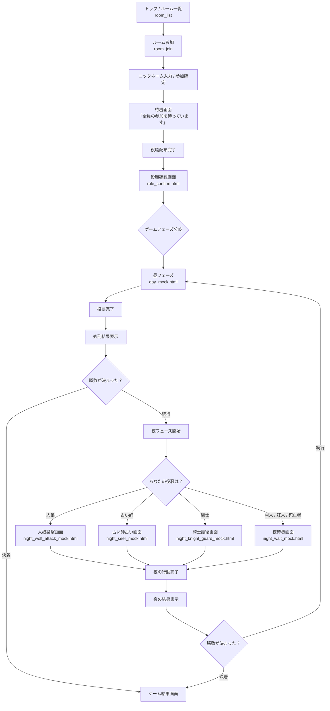

# Jinrou - Web 人狼ゲーム（FastAPI）

本プロジェクトは **FastAPI + SQLite + SQLAlchemy + Pydantic v2** を用いて構築した  
「複数人がスマホから参加できる Web 人狼ゲーム」です。

UI は現在モック（HTML/CSS/JS）を作成中で、  
最終的にはロールごとに異なる画面をスマホ上で表示できる形式を目指しています。

---

# 🚀 特徴

- **役職ごとに見える画面が異なる Web 人狼アプリ**
- バックエンドは **REST API（FastAPI）** 完成済み
- ゲームロジック（昼/夜フェーズ、勝敗判定）も実装済み
- **全 56 テストが PASS**
- ローカル同一ルームで、各参加者が **自分のスマホ**から操作する設計
- 今後 UI を React / Next.js などへ拡張することも可能

---

# 🧩 使用技術

| 分類 | 技術 |
|------|-------|
| 言語 | Python 3.13 |
| Web Framework | FastAPI |
| データベース | SQLite |
| ORM | SQLAlchemy |
| モデル / Validation | Pydantic v2 |
| テスト | pytest |
| その他 | Uvicorn, HTTPX（テスト）, UUID |

---

# 🔧 セットアップ

```bash
git clone https://github.com/hiroto/jinrou.git
cd jinrou

python -m venv .venv
source .venv/bin/activate

pip install -r requirements.txt

uvicorn app.main:app --reload
```

# 📚 API 仕様（概要）

※ 詳細なリクエスト/レスポンスは `app/api` を参照。

## 1. ルーム関連
- `POST /rooms/`  
  ルーム作成

- `GET /rooms/`  
  ルーム一覧取得

- `POST /rooms/{room_id}/join`  
  指定ルームにプレイヤー参加


## 2. ゲーム開始
- `POST /games/{room_id}/start`  
  ルームのメンバーを元にゲームを開始し、役職を自動割り当て


## 3. 昼フェーズ
- `POST /games/{game_id}/day/vote`  
  昼フェーズの投票を送信

- `POST /games/{game_id}/day/resolve`  
  昼フェーズの投票結果を集計し、処刑者を確定


## 4. 夜フェーズ
- `POST /games/{game_id}/night/wolf/attack`  
  人狼が襲撃対象を選択

- `POST /games/{game_id}/night/seer/inspect`  
  占い師が占い対象を選択

- `POST /games/{game_id}/night/knight/guard`  
  騎士が護衛対象を選択  
  ※デフォルト設定では自己護衛は不可

- `POST /games/{game_id}/night/resolve`  
  夜フェーズの行動結果をまとめて処理する


## 5. 勝敗判定
- `POST /games/{game_id}/judge`  
  ゲームの勝敗を判定する。

  ### 判定基準
  - **村人陣営勝利**：生存狼が 0  
  - **狼陣営勝利**：生存狼 + 生存狂人 ≥ 生存村人  

  ※ 狂人は占い・霊媒では「白」だが、勝敗では狼側として扱う。


---

# 🧠 ゲームロジック仕様

## ✔ 昼フェーズ
- 全プレイヤーが 1 人に投票
- 最多得票者を処刑
- 処刑者が人狼だったかどうかの情報はログに記録される


## ✔ 夜フェーズ
- **人狼**：1 人を襲撃  
- **占い師**：誰かを占う（人狼かどうかを判定）  
- **騎士**：1 人を護衛（自己護衛は不可 / 連続護衛は未対応）  
- **村人・狂人・死亡者**：操作なし（待機画面）

夜の行動がそろったら `night/resolve` でまとめて処理する。


## ✔ 勝敗ロジック
- 村人勝利：生存狼が 0  
- 狼側勝利：生存狼 + 生存狂人 ≥ 生存村人  
- 狂人は「村から見ると人間判定」だが、勝敗では狼側


---

# 🖥 UI 実装方針

このアプリは **1 人 1 台のスマホからアクセスして遊ぶ Web 人狼** を目的としている。

### UI の基本方針
- **自分の役職に応じた画面だけが見える**
- 他プレイヤーの行動は表示されない（完全分離 UI）
- 昼 / 夜で画面レイアウトは全く別
- **タップ 1 回で行動が完了**するシンプルな UX
- タイマー（例：昼 5:00）を画面上部に表示
- ログ入力は UI では行わず、サーバ側で記録
- スマホ最適化された HTML モックで UI を作成中


---

# 🗂 画面一覧（UI モック）

| 画面 | ファイル名 | 説明 |
|------|------------|--------|
| ルーム一覧 | `room_list.html` | 参加可能なルームの一覧 |
| ルーム参加 | `room_join.html` | ニックネーム入力・参加 |
| 役職確認 | `role_confirm.html` | 自分の役職を確認 |
| 昼フェーズ | `day_mock.html` | 投票 + 結果確認 |
| 夜（人狼） | `night_wolf_attack_mock.html` | 襲撃対象を選択 |
| 夜（占い師） | `night_seer_mock.html` | 占い対象を選択 |
| 夜（騎士） | `night_knight_guard_mock.html` | 護衛対象を選択 |
| 夜（待機） | `night_wait_mock.html` | 操作不要の役職向け待機画面 |


---

# 🔀 画面遷移図（Player Flow）

下図は **1 人のプレイヤー視点** の UI 遷移である。



# 📈 今後の UI 拡張予定

- UI の本実装（HTML → JS → React などへの発展）
- WebSocket を用いたリアルタイム同期（昼夜切替・結果配信）
- 公開ログ画面の実装（誰がいつ何をしたか一覧表示）
- 観戦モードの追加（プレイヤー以外が状況を確認）
- 役職説明ページの追加（初めてのプレイヤー向け）
- スマホ向け UI の最適化（スワイプ操作・タップ領域拡大）
- タイマーのサーバー同期化（クライアント側の時間ズレ防止）
- 騎士の「連続護衛禁止ルール」の追加（オプション化）
- 結果画面の演出強化（アニメーション / ログの自動再生）
- 複数ルーム同時運用の UI 整備（管理画面アップデート）


